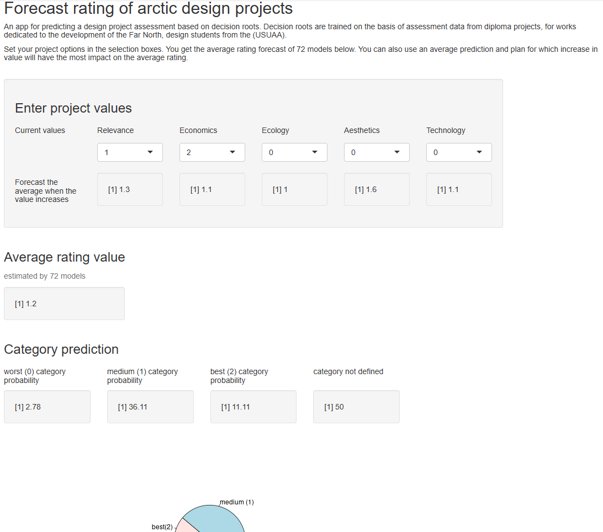

A demonstration of a predictive system based on several trained IRM models. Called decision roots (analogous to a decision forest).
The goal is to use the trained models for prediction and control.

The user enters input values, and based on the composite scores determined by each of the synthesized IRM models, an average final score and a category prediction are generated.

https://lab57.shinyapps.io/dpre/

