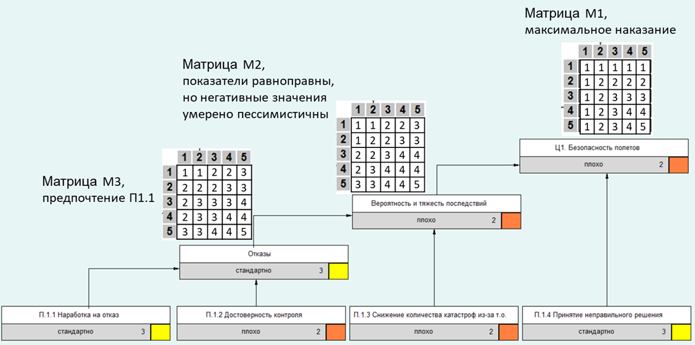

**Description**: Integrated Rating Mechanisms (IRM) were introduced as multidimensional assessment and ranking systems for management and control in organizational and manufacturing systems (for example ACCORD for electronic industry, see Gorelikov, 1984) and are implemented nowadays too (see, for example, Burkov, Novikov, Shchepkin, 2015, Korgin and Rozhdestvenskaya, 2017, Alekseev, Galiaskarov and Koskova, 2019). IRM belongs to the class of so-called verbal decision analysis approaches (VDA) for unstructured problems (see, Larichev and Moshkovich, 2013) and intended to structure them. IRM is intended for ordinal ranking (or classification) with a predetermined number of classes of a finite set of multicriteria alternatives. The key components of IRM are binary tree and convolution matrices, which allow obtaining integrated assessment (IA) based on the values of several parameters – see Figure 1.

 
Fig. 1.  Components of Integrated Rating Mechanism. 

Basic components of this mechanism are:
1.	Convolution tree – a binary tree whose leaves are the indicators used for the assessment of objects, and the root - integrated assessment, used for ranking;
2.	Convolution matrices that determine the values of estimates at intermediate nodes and root of the convolution tree.
3.	Scoring scales for indicators and conversion scales for recalculation of the numerical values of indicators into scoring;
The typical approach to the identification of parameters of IRM in order to implement assumes iterative interaction with decision-makers (see Burkov, Novikov, Shchepkin, 2015). But nowadays there exist inquiry for developing of learning procedures for IRM which are common for AI algorithms identification tasks. In this paper we will show that quite popular nowadays in AI algorithms – one-hot encoding (see, for example, Harris and Harris, 2010, Okada, Ohzeki and Taguchi, 2019) allows one to construct algorithms for identification of IRM on the basis of a set of learning examples. 

**Papers**:

1. Бурков В.Н., Коргин Н.А., Сергеев В.А. Identification of Integrated Rating Mechanisms as Optimization Problem / Proceedings of the 13th International Conference "Management of Large-Scale System Development" (MLSD). М.: IEEE, 2020. С. https://ieeexplore.ieee.org/document/9247638.

2. Сергеев В.А., Коргин Н.А. Identification of Integrated Rating Mechanisms As An Approach To Discrete Data Analysis / IFAC-PapersOnLine. Moscow: Elsevier Ltd, 2021. Volume 54, Issue 13. С. 134–139.

3. Сергеев В.А. DESIGN OF INTEGRATED RATING MECHANISMS BASED ON SEPARATING DECOMPOSITION // Control Sciences. 2022. № 6. С. 2-10.

4. Коргин Н.А., Сергеев В.А. Identification of Integrated Rating Mechanisms on Complete Data Sets / Proceedings of IFIP WG 5.7 International Conference "Advances in Production Management Systems" (APMS 2021) (Artificial Intelligence for Sustainable and Resilient Production Systems). Berlin: Springer, 2021. 630. С. 610-616.

5. Коргин Н.А., Сергеев В.А. Выбор структур при решении задач идентификации механизмов комплексного оценивания для полных наборов данных / Материалы 14-й Мультиконференции по проблемам управления (МКПУ-2021, Дивноморское, Геленджик). Таганрог: Южный федеральный университет, 2021. Т. 2. С. 158-160.

6. Сергеев В.А., Коргин Н.А. Исследование чувствительности дискретной функции для решения задачи синтеза МКО на основе дискретных наборов данных / Материалы 16-й Мультиконференции по проблемам управления (МКПУ-2023, Волгоград). Волгоград: ВолгГТУ, 2023. Т. 2. С. 345-348.

7. Коргин Н.А., Сергеев В.А. Развитие практики применения механизмов комплексного оценивания, в качестве инструмента по выбору транспортных средств для выполнения полетных заданий / Труды научно-практической конференции «Технологическое развитие авиастроения: глобальные тенденции и национальные интересы России» (Москва, 2022). М.: НИЦ "Институт им. Н.Е. Жуковского", 2023. С. 538.

8. Кравчук С.Г., Коргин Н.А., Сергеев В.А. Арктический дизайн: опыт междисциплинарного конструирования предметной области // Журнал ВШЭ по искусству и дизайну. 2025. № 8 (4). С. 10-41.

The main code, in accordance with the proposed methodology of synthesis of the IRM, is presented in two catalogs: Structures and Matrices.

